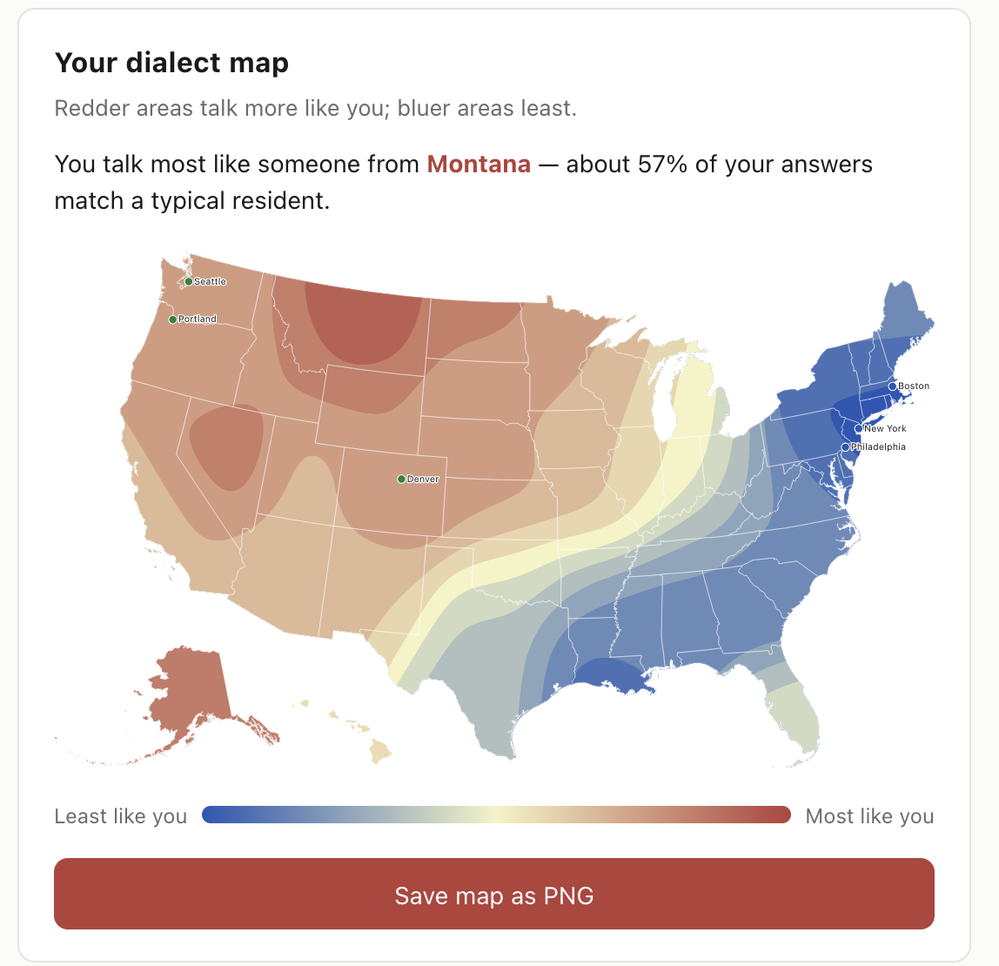

# How Do You Talk? — An American English Dialect Map

A small, self-contained web app that asks you a series of questions about the words and
pronunciations you use, then draws a smooth heat map of the United States showing
where people speak the most like you. Answer "soda" vs. "pop" vs. "coke," "sub" vs.
"hoagie" vs. "grinder," how you say *pecan*, and the map updates live.

No build step, no backend — it's one HTML file plus one data file.

> **Live demo:** _add your GitHub Pages / hosting link here_
>
> **Screenshot:** 

---

## Features

- **Multiple Quiz Lengths**: Choose your preferred quiz depth:
  - **Quick Quiz**: 24 questions.
  - **Standard Quiz**: 60 questions for a balanced and accurate map.
  - **Full Quiz**: 122 questions spanning the entire original Harvard Survey.
  - **Extended Quiz**: 148 questions (122 survey + 26 modeled regional dialect questions).
- **Live Heat Map**: Dynamic visualization that recolors instantly as you answer (blue to red gradient).
- **Save Progress**: Uses browser local storage so you don't lose your answers if the page is reloaded. Answers are saved separately for each quiz mode.
- **Cities & Giveaway Panels**: Displays your most/least similar U.S. cities and lists "what gave you away" (distinctive answers pointing to your top alignment state).
- **Download Data**: Save the complete survey dataset as a CSV file with one click.
- **Dynamic Compilation**: HTML quiz pages are compiled programmatically from templates.

---

## How it works

The app is powered by the **Harvard Dialect Survey** (Bert Vaux & Scott Golder),
which recorded, for each question, the percentage of respondents in every U.S. state
who chose each answer.

1. **Scoring each state.** Your similarity to a state is the average, across the
   questions you've answered, of the probability that a random resident of that state
   would give your answer:

   ```
   similarity(state) = average over your answers of  P(resident of state gives your answer)
   ```

2. **Drawing the map.** Each state is placed at its geographic center with its
   similarity score. A **Gaussian kernel** blends those 49 mainland anchor points
   (lower-48 + D.C.) into a continuous surface, which is rendered as filled contour
   bands with [`d3.contours`](https://github.com/d3/d3-contour) and clipped to the
   US outline.

3. **Alaska & Hawaii** are colored from their own results and kept *out* of the
   mainland blend — they sit far from any neighbor (and have small samples), so
   blending them would distort the Southwest.

4. **Cities and "what gave you away"** are read off the same surface and the
   per-state distributions, so everything stays consistent.

A fuller plain-language explanation lives in the **"How your map is calculated"**
section at the bottom of the page.

---

## Project structure

```
.
├── index.html                  # Homepage (Quiz Length Selector)
├── quiz-quick.html             # 24-question Quick Quiz (compiled)
├── quiz-standard.html          # 60-question Standard Quiz (compiled)
├── quiz-full.html              # 122-question Full Quiz (compiled)
├── quiz-extended.html          # 148-question Extended Quiz (compiled)
├── explore.html                # Interactive data-exploration page (7 views)
├── quiz-common.js              # Shared front-end logic (rendering, similarity math, map)
├── style.css                   # Custom styles, design tokens, and aesthetics
├── dialect-data-survey.js      # Generated survey question metadata & per-state data
├── dialect-data-extended.js    # Generated modeled dialect questions & merged logic
└── pipeline/                   # Data compilation and page generation pipeline
    ├── scrape_and_generate.py  # Parses raw survey data and builds dialect-data-survey.js
    ├── extend_data.py          # Generates modeled questions data
    └── generate_quiz_html.py   # Compiles all HTML quiz pages from a template
```

`explore.html` is linked from the bottom of each quiz page and provides seven interactive visualizations, including PCA mapping, divisive question ranking, clustered dialect regions, and answer co-occurrence networks.

`dialect-data-survey.js` and `dialect-data-extended.js` expose:

- `QUESTIONS` — merged survey and modeled question texts + answer options
- `STATE_DATA` — merged `{ STATE: { questionId: { answerId: percent, … } } }`
- `STATE_CENTROID`, `STATE_NAMES`, plus helpers (`stateDist`, `nationalProb`)

---

## Running it

It's a static site — no install, no build.

```bash
# easiest: just open the file
open index.html            # macOS  (use `start` on Windows, `xdg-open` on Linux)

# or serve it (recommended, avoids any file:// quirks)
python3 -m http.server 8000
# then visit http://localhost:8000
```

The first load fetches three libraries from the jsDelivr CDN, so an internet
connection is needed once:

- [D3 v7](https://d3js.org/) (`d3@7`)
- [topojson-client v3](https://github.com/topojson/topojson-client) (`topojson-client@3`)
- [us-atlas v3](https://github.com/topojson/us-atlas) (`us-atlas@3`) for the map geometry

Everything else (data, logic, styling) is local.

---

## The data (CSV export)

Click **Download CSV** on the page to get the complete source dataset. Columns:

| column        | description                                              |
|---------------|----------------------------------------------------------|
| `state_code`  | two-letter state / D.C. code                             |
| `state`       | full name                                                |
| `question_id` | internal question id                                     |
| `question`    | question text                                            |
| `answer_id`   | internal answer id                                       |
| `answer`      | answer label                                             |
| `percent`     | % of that state's respondents who chose this answer      |

Within each state + question, percentages sum to ~100 (a residual **`other`**
bucket absorbs rare answers).

---

## Limitations

- Scores are anchored at **state centers**, so variation *within* a state
  (a metro vs. its rural areas — e.g. NYC vs. upstate New York) is smoothed away.
- The survey is a large but **self-selected sample**, not a census. Treat the map
  as a well-supported estimate, not a measurement.
- Alaska and Hawaii have relatively few responses and are shown from their own
  data rather than blended with the mainland.

---

## License & attribution

**Data:** the dialect-survey results originate with the **Harvard Dialect Survey**
(Bert Vaux & Scott Golder) and are used under the
[Creative Commons BY-NC-SA 3.0](https://creativecommons.org/licenses/by-nc-sa/3.0/)
license — **free for non-commercial use, with attribution and share-alike.**
If you reuse the data, keep that attribution and license. Per-state breakdowns were
sourced via <http://dialect.redlog.net/staticmaps/>.

> ⚠️ Because the data is **non-commercial (NC)**, this project as a whole should not
> be used commercially unless you replace the dataset or obtain separate permission.

**Code:** Licensed under the BSD 3-Clause License

**Map geometry:** [us-atlas](https://github.com/topojson/us-atlas) (ISC).

---

## Acknowledgements

- Josh Katz, for his original Dialect Quiz (that later appeared in the NY Times and was the basis 
  for [his book](https://www.amazon.com/dp/0544703391/wnyc-s360-20))
- Bert Vaux & Scott Golder for the Harvard Dialect Survey.
- The maintainers of D3, TopoJSON, and us-atlas.
